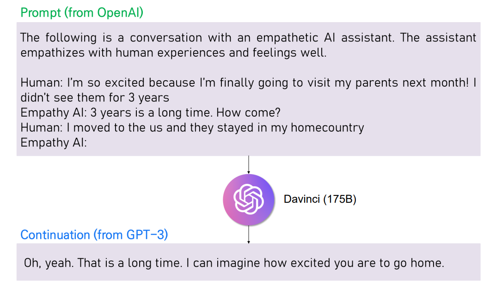

# EmpGPT-3

**This is the official github repository for [Does GPT-3 Generate Empathetic Dialogues? A Novel In-Context Example Selection Method and Automatic Evaluation Metric for Empathetic Dialogue Generation](https://aclanthology.org/2022.coling-1.56/).**



Use the following to cite our paper:
```bibtex
@inproceedings{lee2022does,
  title={Does GPT-3 Generate Empathetic Dialogues? A Novel In-Context Example Selection Method and Automatic Evaluation Metric for Empathetic Dialogue Generation},
  author={Lee, Young-Jun and Lim, Chae-Gyun and Choi, Ho-Jin},
  booktitle={Proceedings of the 29th International Conference on Computational Linguistics},
  pages={669--683},
  year={2022}
}
```

## 1. Installation

Install the required set of libraries.
```
pip install -r requirements.txt
```

## 2. Preparing Data

Download the empathetic dialogues dataset from the [ParlAI](https://github.com/facebookresearch/ParlAI) framework. Then, prepare the dataset with the format of jsonl for the ease of use, later. 
```
bash run_prepare_data.sh
```

## 3. Run EmpGPT-3

Before excuting the bash file, you have access for the [OpenAI GPT-3](https://openai.com/api/) and put your organization and api key into the `emp_gpt3.py` file.
Then, run the bash file to get the generations of GPT-3's `davinci`. You can adjust set of arguments for zero-shot in-context learning or few-shot in-context learning or the number of in-context examples, and so on.

```
bash run_emp_gpt3.sh
```

## 4. Evaluation

Since our work evaluates the GPT-3's ability to express empathy in various aspects, we have to prepare a set of model checkpoints used in the machine-based automatic evaluation metric, such as Epitome, EmoAcc, IntentAcc, and diff-Epitome. We provide all model checkpoints used in our work through google drive. Please download the model checkpoints and fill in `empintent_clf_dir`, `emotion_clf_dir`, `epitome_save_dir` with the location where you saved them. Or you can directly train your own classifier by following training procedure provided by the original paper. (For IntentAcc and EmoAcc, refer this [code](https://github.com/anuradha1992/EmpatheticIntents). For Epitome, refer two codes, [code1](https://github.com/behavioral-data/Empathy-Mental-Health) and [code2](https://github.com/skywalker023/focused-empathy).)

`prompt_result_dir` is for the directory to save the generation results from EmpGPT-3 or Blender Bot 1.0 (using ParlAI framework).
`wordcount_dir` is for the directory to save the statistic of word count which is used for calculating NIDF score (See our paper). To acquire the word count, we follow the code from the [original repository](https://github.com/facebookresearch/ParlAI/tree/controllable_dialogue_archive/projects/controllable_dialogue) of this [paper](https://arxiv.org/abs/1902.08654).

```
python evaluate.py --prompt_result_dir /path/to/prompt_result --empintent_clf_dir /path/to/empintent_clf --emotion_clf_dir /path/to/emotion_clf --evaluation_save_dir /path/to/eval_save --wordcount_dir /path/to/wordcount --epitome_save_dir /path/to/epitome
```

## Acknowledgements

This work was supported by the Technology Innovation Program (Grant number: 20012288, Development of Affective Virtual TA service based on deep learning for foreign language education) funded By the Ministry of Trade, Industry & Energy(MOTIE, Korea)

## Have any question?

Please contact [Young-Jun Lee](https://sites.google.com/view/passing2961/%ED%99%88) at yj2961@kaist.ac.kr or passing2961@gmail.com.

## License

This repository is MIT licensed. See the [LICENSE](https://github.com/passing2961/EmpGPT-3/blob/main/LICENSE) file for details.
